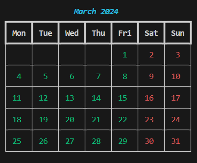

# 📅 Colorful Calendar Project

A Python script that generates a beautifully formatted calendar for any given year using the `rich` library for enhanced terminal output.

## Features

🎨 Color-coded days (weekdays in green, weekends in red)

📆 Month-by-month display in a table format

📅 Supports any year input

✨ Clean, visually appealing output with borders

## Setup Process

Follow these steps to get started with Colorful Calendar:

### 1. Clone the Repository

```bash
git clone https://github.com/dilushamadushan/Colorful-Calendar.git
cd Colorful-Calendar
```

### 2.Install dependencies

```bash
pip install rich
```

### 3.Run 

```bash
python calendar.py
```

## Example Output


